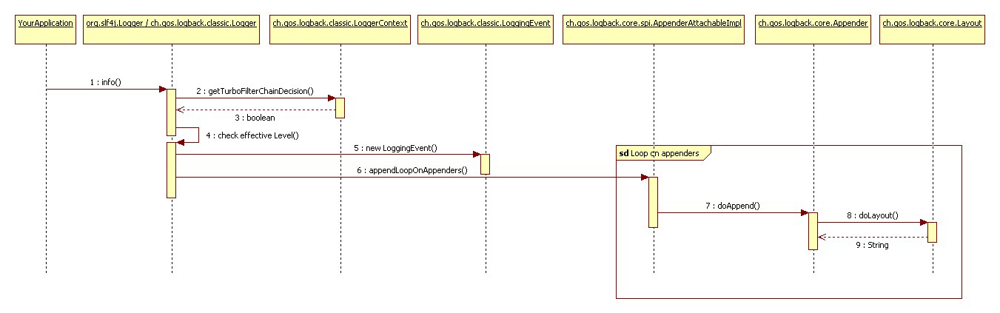

# 章节2：logback 体系结构

原文链接：[Chapter 2: Architecture](https://logback.qos.ch/manual/architecture.html)

> 所有正确的分类都是族谱结构的。
> 
> --《物种起源》查尔斯·达尔文
> 
> 任何人在学习一门学科的时候如果仅仅是只阅读学习一些资料而不把他们应用到
> 一些实际问题的解决上，而仅仅是强迫他们自己去思考他们在学什么，想要把这些知识学会不是说不可能做到，而是要做到这点是非常困难的。因此，我们所学到的最好的知识就是我们自己发现、总结的。
> 
> -- 《计算机程序设计艺术》
> 

## logback 的体系结构

`logback` 的基础体系结构足够通用，因此它能够适用在不同情况中。目前
`logback` 被划分为3个模块： `logback-core`、`logback-classic`、l`ogback-access`。

核心模块为其他两个模块奠定了基础。classic 模块扩展了 core 模块功能，并且 classic 模块可以算是一个 log4j 的显著改进版本。 logback-classic 自然的实现了 SLF4J API，因此你可以自由的在 logback 和其他日志系统(如log4j 或者是 JDK 1.4 中引入的 java.util.logging)中切换.access模块用来是 Servlet 容器集成可以提供 HTTP-access日志功能。后面有单独的文档介绍 access 模块。

在文档的剩余部分，我们说 "logback" 就是在说 "logback-classic" 模块。

## Logger、Appenders 和 Layouts

Logback 的三个核心类： Logger, Appender 和 Layout。这三个组件协同工作，以便开发者可以在决定日志消息的类型、级别、输出格式和输出目的地。

Logger 类是 logback-classic 模块的一部分。换句话说， Appender 和 Layout 接口是 logback-core 模块的一部分，做一个通用的基础模块， logback-core 是没有 logger 的概念的。

### Logger 上下文

首先，任何日志API相对 System.out.println 最重要的优势就是，日志API允许禁止某些日志输出的同时允许其他一些日志不受阻碍。这个功能假定，开发人员可以根据自己的标准来选择日志空间（日志空间就是所有可能的日志语句）。在 logback-classic 模块中，分类功能是 logger 的一部分固有功能。每个 logger 都会附加到一个 LoggerContext 中， LoggerContext 用来创建 Logger 并把 logger 组织为一个树形的层次结构。

logger 被称为实体，他们的名字是区分大小写的，并且他们的名字遵循 层次化命名规则（hierarchical naming rule）：

> #### 层次化命名
> 如果一个 logger 的名字是另外一个 logger 的逗号分隔符的前缀


Named Hierarchy
A logger is said to be an ancestor of another logger if its name followed by a dot is a prefix of the descendant logger name. A logger is said to be a parent of a child logger if there are no ancestors between itself and the descendant logger.

例如：一个名叫 "com.foo" 的 logger 是一个名叫 "com.foo.Bar" 的父亲（parent）。类似的，"java" 是 "java.util" 的父亲并且是 "java.util.Vector" 的祖父。这种命名模式是被大部分的开发者所熟知的。

root logger 在整个 logger 层级的最顶层。它的特殊之处在于，它一开始就是每个层次的一部分。和所有 logger 一样，root logger 也可以通过名字检索它，代码如下：

```
Logger rootLogger = LoggerFactory.getLogger(org.slf4j.Logger.ROOT_LOGGER_NAME);

```

其他的 logger 也可以通过 org.slf4j.LoggerFactory 的静态方法 getLogger 来检索他们。此方法将所需日志记录器的名称作为参数。下面列出了Logger接口中的一些基本方法。

```
package org.slf4j; 
public interface Logger {

  // Printing methods: 
  public void trace(String message);
  public void debug(String message);
  public void info(String message); 
  public void warn(String message); 
  public void error(String message); 
}
```

### 有效的 level 又称 level 继承

Loggers 是可以被分配 level 的。可用的 levels（TRACE, DEBUG, INFO, WARN 和 ERROR）定义在 ch.qos.logback.classic.Level 类中。
需要注意的是，在logback中。 Level 类是 final 的不能被继承，不能有子类。Level 会作为一种更灵活的形式存在于被标记的对象中。

> 原文：the Level class is final and cannot be sub-classed, as a much more flexible approach exists in the form of Marker objects.

如果一个 logger 没有指定 level，它会继承它最近的一个祖先 logger 的 level。

> 一个 logger L 的有效记录级别等同于：从 L 开始向 root logger 层级搜索时遇到的第一个不是 null 级别的日志 level。

为了保证所有的 logger 都能继承到一个有效的 level。 root logger默认的日志级别是 DEBUG。

下面的4个例子列举了，根据 level 继承规则，指定 level 值和最终有效 level 值：

##### Example 1
| Logger 名称|指定 level|有效 level|
|:---:|:---:|:---:|
|X	   | none | DEBUG|
|X.Y   | none | DEBUG|
|X.Y.Z | none | DEBUG|

example 1 中，只有 root logger 被指定了 level，默认级别为 DEBUG，其他的 loggers X, X.Y 和 X.Y.Z 继承了这个级别。

##### Example 2
| Logger 名称|指定 level|有效 level|
|:---:|:---:|:---:|
|root |ERROR |ERROR|
|X|INFO|INFO|
|X.Y|DEBUG|DEBUG|
|X.Y.Z|WARN|WARN|

example 2 所有的 loggers 都指定了一个 level，所以不需要使用继承的 Level。

##### Example 3
| Logger 名称|指定 level|有效 level|
|:---:|:---:|:---:|
|root	|DEBUG|	DEBUG|
|X|	INFO|	INFO|
|X.Y|	none|	INFO|
|X.Y.Z|	ERROR|	ERROR|

exampl 3 中 logger root，X和 X.Y.Z 分别指定了 DEBUG、INFO、ERROR 级别的 level。 Logger X.Y 从它的父 logger X 中继承了 level。

##### Example 4
| Logger 名称|指定 level|有效 level|
|:---:|:---:|:---:|
|root|	DEBUG|	DEBUG|
|X|	INFO|	INFO|
|X.Y|	none|	INFO|
|X.Y.Z|	none|	INFO|

example 4 中，loggers root 和 X 分别指定了 DEBUG 和 INFO 的 level， loggers X.Y 和 X.Y.Z 从 X 中继承了 level；

### 打印方法和级别选择规则

通过定义来说，打印方法决定了一个 logger 需要的 level。比如一个 L 是一个 logger 实例，那么打印语句`L.info("...")` 需要 L 的 level 为 INFO。

如果 logging 的请求级别高于或者等于 logger 本身的级别，那么我们就说这个日志被启用了，否则说这个日志被禁用了。根据前面的描述，一个没有指定的 logger 会从它最近的一个父类继承一个级别。这条规则的总结如下：

> ### 基本选择规则
> 如果一个日志需要的级别为 p，logger的有效级别为 q，那么当前 p >= q 的时候日志有效。

这条规则是 logback 的核心，它假定 levels 具有如下的顺序： TRACE < DEBUG < INFO <  WARN < ERROR.

下表以更形象的形式展示了这条规则是如何运行的。下表中，横表头表示的是 logger 的有效 level q，竖表头表示的是日志需要的 level p，交叉点表示的是基本选择规则的结果（basic selection rule）。

|level p|TRANCE|DEBUG|INFO|WARN|ERROR|OFF|
|:-----:|:----:|:----:|:----:|:----:|:----:|:----:|
|TRACE|	YES|	NO|		NO|		NO|	NO|	NO|
|DEBUG|	YES	|	YES	|	NO	|	NO|	NO|	NO|
|INFO|		YES	|	YES	|	YES	|	NO	|NO|	NO|
|WARN|		YES	|	YES	|	YES	|	YES	|	NO	|NO|
|ERROR|	YES	|	YES	|	YES	|	YES	|	YES	|NO|

下面是一个关于基本选择规则的例子：

```java
mport ch.qos.logback.classic.Level;
import org.slf4j.Logger;
import org.slf4j.LoggerFactory;
....

//获取一个名叫 "com.foo" 的实例，logger 的类型使用 ch.qos.logback.classic.Logger 这样我们就可以通过 API 设置logger 的level
ch.qos.logback.classic.Logger logger = 
        (ch.qos.logback.classic.Logger) LoggerFactory.getLogger("com.foo");
// 设置级别为 INFO 级别
logger.setLevel(Level. INFO);

Logger barlogger = LoggerFactory.getLogger("com.foo.Bar");

/ 这个日志是有效的，因为 WARN >= INFO
logger.warn("Low fuel level.");

//这个日志是无效的，因为 DEBUG < INFO
logger.debug("Starting search for nearest gas station.");

// 名字叫做 com.foo.Bar 的logger 会从 com.foo 继承 level
// 所以这个日志是有效的，因为 INFO >= INFO
barlogger.info("Located nearest gas station.");

// 这个日志是无效的，因为 DEBUG < INFO 
barlogger.debug("Exiting gas station search");
```


### 检索 Loggers

调用 LoggerFactory.getLogger 方法，只要 logger 的 name 相同，那么这个方法总会返回同一个对象。

例如：

```java
Logger x = LoggerFactory.getLogger("wombat"); 
Logger y = LoggerFactory.getLogger("wombat");
```

x 和 y 会引用同一个对象。

因此，你可以先配置一个 logger 然后在需要的地方再检索它们，而不用将引用传递过去。与生物学的父子关系不同，在logback 中不用先创建 parent 再创建 children，logback 中可以先创建任意 logger ，即使 "parent" logger 后创建后会自动发现并连接到它的后代上面去。

通常在应用中，都是先配置 logback 的环境信息。一般都是先读取一个配置文件，后面我们会再讨论这点。

软件组件可以很容易的为 logback 的 loggers 命名。你可以使用类的全限定名作为 logger 的 name 然后在每个类中都实例化一个 logger。这是一种很使用并直观的命名方式。这种方式可以很容易的追溯一条日志的起源类。然而，这只是一种常见的命名方式，Logback 不会限制 loggers 的命名。你可以随意的给你的 logger 起名字。

不过，以 logger 所在的类命名 logger 似乎是迄今为止所知的最佳通用策略。

### Appenders 和 Layouts

根据日志程序选择性地启用或禁用日志记录请求的功能只是一部分。Logback允许将日志请求打印到多个目的地。在logback中，日志 output 的目的地称为 appender。目前，logback 提供了下列 appender ： 到 console、文件、远程 socket servers、MySQL、PostgreSQL、Oracle和其他数据库、JMS和远程 UNIX Syslog daemos。

每个 logger 可以输出到 1到多个 appender。

addAppender 方法允许将一个 appender 添加到一个 logger上。每个有效的日志请求都会被logger 转发到所有这个 logger 添加过的 appender 及 appender 层次结构中更高层次的 appender 上。 换句话说，appenders 会从 logger 的层次中继承。例如， 如果一个 console appender 添加到了 root logger 上，那么所有的日志记录请求最少会打印到控制台上。如果 logger L 添加了一个 文件 appender ，那么 L 和 L 的子 logger 上所有有效的日志请求都会打印到这个文件和 console 上。**可以通过修改 logger 的 additive 属性值为 false ，来关闭默认的 appender 继承行为。**

下面总结了 appender 的"可加性"（additivity）规则：

> ### Appender Additivity(Appender 可加性)
> 
> 属于"Appender Additivity"(Appender 可加性)是指： logger L的日志输出语句会发送给 L 及其祖先的所有 appenders。
> 
> 然后，如果一个 Logger L 的祖先 Logger P 的 additivity 的标记被设置为 false， 那么 L 的输出会被发送给 L 以及 L 到 P（包括P）的所有 appender，但是不会发送给 P的祖先 logger。

**Logger 的 additivity 标记默认是 true 的。**
下面的表展示了这种可加性：


|Logger名字|附加的 Appenders|Additivity标记|Output目标|备注|
|:--------:|:--------:|:--------:|:--------:|:--------:|
|root	|A1	|无效|	A1|root logger 是层次结构的最顶层，所以 additivity 标记无效|
|x	|A-x1, A-x2|	true|	A1, A-x1, A-x2| x 和root 的Appender|
|x.y|	无|	true|	A1, A-x1, A-x2|	x 和root 的Appender|
|x.y.z|A-xyz1|	true|	A1, A-x1, A-x2, A-xyz1|x.y.z 、x 和root 的Appender|
|security|A-sec|	false|	A-sec|无 Appender 累计，因为 additivity 设置为了false，仅应用 A-sec Appender|
|security.access|none|	true|	A-sec|因为 security 的 additivity 的标记设置为了 false，所以仅能累加到 security的 appender|	

通常，用户不仅希望可以自定义日志输出目的地，还希望可以控制输出的格式。这可以通过为 appender 关联一个 layout 来实现。layout 负责将日志请求格式为用户期望的格式，而 apender  只负责将格式化好的日志输出到目的地。 PatternLayout 是 logback 发行版的一部分，PatternLayout 允许用户按照类似 C 语言的 printf 方法一样来指定转换模式（conversion pattern）。

例如，如果给 PatternLayout 指定转换模式为： "%-4relative [%thread] %-5level %logger{32} - %msg%n" 将会有如下的输出：

```
176  [main] DEBUG manual.architecture.HelloWorld2 - Hello world.
```

第一个字段（即 %-4relative）表示的是自程序启动依赖花费的毫秒数。第二个字段（即[thread]）表示的是打印日志的线程。第三个字段(即 %-5level)是日志等级。第四个字段（即%logger{32}）表示的是logger的name. '-' 后面的信息输出的是日志内容。

## 参数化日志

`logback-classic` 中的 logger 实现了 `SLF4J` 的日志接口。logger 接口提供了多重重载的日志打印方法。这些重载方法主要目的是在不影响代码可读性的前提下提升代码性能。

一些开发人员可能会有如下日志代码写法：

```java
logger.debug("Entry number: " + i + " is " + String.valueOf(entry[i]));
```

上面的代码会产生构造方法参数的开销，这些开销包括：将 integer 的 i 和 entry[i] 转换为 String 类型，以及字符串拼接代价。而这个代价是和日志打印无关的，即即使日志不输出也需要承担这些时间花费。

一种可行的避免参数构造的时间花费的方式是，使用 log 状态判断语句包裹整个输出语句，类似：

```
if(logger.isDebugEnabled()) { 
  logger.debug("Entry number: " + i + " is " + String.valueOf(entry[i]));
}
```

上面的方法当不需要输出 debug 级别的日志的时候是不需要承担参数构造的代码的。另一方面，当你需要输出 debug 级别的日志的时候，则需要花费两次时间来评估是否启用了 debug 级别的日志：一次在在 debugEnabled 方法，另一次在 debug 方法中。在实践中，这种开销是微不足道的，因为评估一个 logger 级别的时间花费不到处理一个请求所需的时间的1%。

## 更好的选择

当前存在一种基于消息格式化的、方便的替代选择。假设entry是一个对象，可以这样写:

```
Object entry = new SomeObject(); 
logger.debug("The entry is {}.", entry);
```


只有在评估日志记录是否需要输出之后，而且只有当决定输出日志时，logger 的实现类才会格式化消息，并用 entry 的字符串值替换“{}”对。换句话说，当 log 语句不需要输出时，此方法不会产生参数构造的成本。

下面两行代码将产生完全相同的输出。然而，在禁用日志语句的情况下，第二种方法的性能至少比第一种好30倍。

```
logger.debug("The new entry is "+entry+".");
logger.debug("The new entry is {}.", entry);
```

logger 还提供了含有两个2参数的重载方法，比如：

```
logger.debug("The new entry is {}. It replaces {}.", entry, oldEntry);
```

如果需要格式化3个或者更多参数时，可以使用一个 Object[] 作为参数，比如：

```
Object[] paramArray = {newVal, below, above};
logger.debug("Value {} was inserted between {} and {}.", paramArray);

```

# 揭开内部奥秘

我们已经介绍了 `logback` 的重要组件，现在我们将介绍下当用户调用 logger 的日志打印方法时，`logback` 框架的处理步骤。现在让我们分析下，当用户调用一个名字为 “com.wombat” 的 logger 的 info() 方法时的处理步骤。

## 1. 获取 filter 链
如果配置了 `TurboFilter` ，那么会先调用 `TurboFilter`。 `TurboFilter` 可以设置一个上下文范围内的阈值，或者根据与每个日志请求关联的 `Marker`、`Level`、`message` 或 `Throwable` 等信息过滤掉某些事件（事件就是日志输出请求）。如果 filter 链返回了 `FilterReply.DENY` ，那么日志输出请求会被丢弃。如果返回了 `FilterReply.NEUTRAL` 会继续进入到 步骤2中。如果返回了 `FilterReply.ACCEPT`, 会直接进入到第3步进行处理。

## 2. 应用基本选择规则
在这一步中，`logback` 会比较 logger 的有效日志级别和日志输出请求的级别.如果日志输出请求被禁用，`logback` 会丢掉日志请求。否则，会进入到下一步处理。

## 3. 创建一个 LoggingEvent 对象
如果日志输出请求通过了前面的过滤，logback会创建一个 `ch.qos.logback.classic.LoggingEvent` 对象，这个对象包含了请求相关的参数，如 logger 对象，`level`、`message`、`exception`、`当前时间`、`当前的线程`、`class相关的各种数据`、`MDC`。注意，前面提到的某些信息是延迟初始化的，它们仅在需要的时候才会被解析。`MDC` 用来装饰日志请求的附加信息。关于 `MDC` 的更多信息会在后面的章节讨论。

## 4. 调用 Appenders
当创建了 `LoggingEvent` 对象后，`logback` 会调用当前 logger 从上下文中继承的各种 appender 的 `doAppend()` 方法。

`logback` 发行版发布的所有 appender 都继承自 `AppenderBase` 抽象类，这个类的 `doAppend` 方法是 `synchronized` 的，它保证了 `doAppend` 的线程安全性。
`AppenderBase` 的 `doAppend` 方法还会调用那些动态附加到它上面的各种自定义的 filters ，后面的章节会单点介绍。
  
## 5. 格式化输出
appender 有责任去格式化日式输出事件。然而，一些appender（不是所有的）会把日志格式化委托给一个 layout。layout 会把 `LoggingEvent` 实例格式化并返回一个 `String` 信息。注意，有一些 appender ，比如 `SocketAppender` ，它不会将日志事件格式化为一个 string 而是会序列化它，因此，他们也不需要 layout。

## 6.输出 LoggingEvent
当日志事件被格式化后，它会被发送到 appender 的目的地。

下面的 UML 图展示了每一步的工作。



# 性能

反对日志输出的人经常引用的一个问题，就是日志输出的成本。这是一个合理的问题，因为即使是中等大小的应用程序也可能生成数千个日志请求。我们的大部分开发工作都花在度量和调整 `logback` 的性能上。除了这些努力之外，用户还应该注意以下性能问题。

## 1. 当日志完全关闭时的日志记录性能

你可以通过将 root logger 的 level 设置为 `Level.OFF` 来完全关闭日志输出。当日志输出完全关闭时，日志语句的成本为：一个方法调用和一个整数比较的成本。在 3.2Ghz 的奔腾D机器上，这一成本通常在20纳秒左右。

然而，任何方法的调用都可能包含一个隐藏的成本：参数构造。例如下面的代码：

```
x.debug("Entry number: " + i + "is " + entry[i]);
```

上面的代码，不管日志是否输出都需要承担参数构造的成本，包括：将 Integer i 和 entry[i] 转换为 string 并拼接一个新的 string 的成本。

参数构建的成本可能相当高，这取决于所涉及参数的大小。为了避免参数构建的成本，你可以利用`SLF4J`的参数化日志记录:

```
x.debug("Entry number: {} is {}", i, entry[i]);
```


这种变体不会产生参数构造的成本。与前面对 `debug()` 方法的调用相比，它的速度要快得多。只有在将日志记录请求发送到 appender 时才会对消息进行格式化。此外，格式化消息的组件经过了高度优化。

尽量不要将上面的代码放到放在紧凑的循环中，即频繁调用的代码。这是一个非常不好的习惯，可能会导致性能下降。即使关闭了日志记录，在紧凑循环中进行日志记录也会降低应用程序的运行速度，如果打开日志记录，则会生成大量(可能是无用的)输出。

## 2.当启用日志时决定是否需要输出日志的性能

在 `logback` 中，不需要遍历 logger 层次结构。当创建 logger 时，logger 知道它的有效级别(也就是说，一旦考虑了级别继承，就知道它的级别)。如果 parent logger 的级别被更改，那么将联系所有子 logger 以注意更改。因此，在接受或拒绝基于有效级别的请求之前，日志记录器可以做出准瞬时决策，而不需要咨询其祖先。


## 3.实际日志输出（格式化和要输出的目标设备）

格式化日志输出并将其发送到目标目的地的会花费一定成本。这里，我们再次认真地努力使 layouts (formatters)尽可能快地执行，对于 appenders 也是如此。在本地机器上记录文件时，实际日志记录的典型成本大约是9到12微秒。当将日志记录到远程服务器上的数据库时，它的时间最长可达几毫秒。


尽管特性丰富，但logback的首要设计目标之一是执行速度，这是仅次于可靠性的需求。为了提高性能，已经重写了一些 logback 组件。
