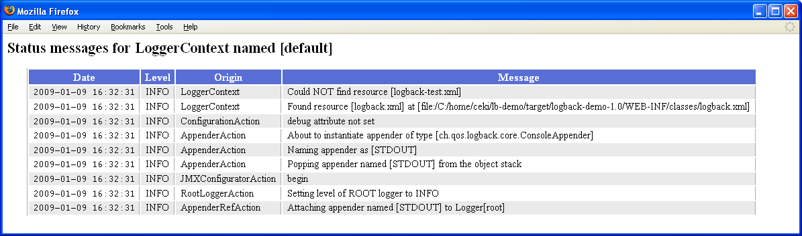

# 章节3：Logback 配置
> 源文件链接： [Logback Configuration](https://logback.qos.ch/manual/configuration.html)

In symbols one observes an advantage in discovery which is greatest when they express the exact nature of a thing briefly and, as it were, picture it; then indeed the labor of thought is wonderfully diminished.

—GOTTFRIED WILHELM LEIBNIZ

本章我们将介绍 `logback` 的配置方法，本章会有很多配置脚本的示例。稍后的章节我们将会介绍 `logback` 的配置框架：`Joran`。

## Logback 的配置

在应用代码中插入日志输出语句需要做一些规划和努力。观察表明，程序中大约 4% 的代码是日志输出语句。因此，即使是一个中等规模的应用程序也会包含数千行的日志输出语句。基于这种数据量级考虑，我们需要一个能管理日志语句的工具。

可以使用程序代码或者是 XML、Groovy 脚本的格式来配置 `logback`。顺便说一句，`log4j` 的用户可以使用我们提供的 [`PropertiesTranslator` 应用程序](http://logback.qos.ch/translator/)将 `log4j.properties` 转换为 `logback.xml` 文件。

现在，让我们看一下 `logback` 尝试的初始化步骤：

1. `logback` 尝试在 `classpath` 中搜索名叫 `logback-test.xml` 文件；
2. 如果没有发现 `logback-test.xml` 会尝试在 `classpath` 中搜索 `logback.groovy` 文件。
3. 如果还没有找到，会尝试在 `classpath` 中搜索 `logback.xml` 文件。
4. 如果上面的文件都没找到，`logback` 会通过 `service-provider loading facility`（JDK 1.6 中引入的 `SPI` 技术）解析类路径下的 `META-INF\services\ch.qos.logback.classic.spi.Configurator` 文件，并找到实现了 `com.qos.logback.classic.spi.Configurator` 接口的类，文件中要对的类配置全限定名。
5. 如果上面的步骤都没成功，`logback` 会自动的使用 `BasicConfigurator` 来初始化它，这个配置会将日志输出到 `console`。

最后一步的意识是：做最后的努力，使用一个默认的日志输出配置（这个配置非常简单基础）来提供日志输出能力。

如果你使用 `Maven` 并且你将 `logback-test.xml` 文件放在了 `src/test/resources` 文件夹下， `Maven` 会确保它不会发布到生成包中。因此，你可以在不同地方使用不同的配置文件。在单测的时候使用 `logback-test.xml` ，在生产环境中使用 `logback.xml` 。

`FAST START-UP`(快速启动)：`Joran` 解析一个 logback 配置文件大约需要 100 毫秒。要在应用程序启动时缩短这些毫秒，可以使用 `service-provider loading facility` （上面第4点提到的）来加载您自己的自定义配置器类，扩展 `BasicConfigrator` 是一个很好的起点。


## 自动配置 logback

logback 的最简单配置方法就是让 logback 在初始化查找时失败降级为：使用默认配置。我们可以在下面的 `MyApp1` 中体验下这是如何实现的。

#### Example: Simple example of BasicConfigurator usage 
```java
package chapters.configuration;

import org.slf4j.Logger;
import org.slf4j.LoggerFactory;

public class MyApp1 {
  final static Logger logger = LoggerFactory.getLogger(MyApp1.class);

  public static void main(String[] args) {
    logger.info("Entering application.");

    Foo foo = new Foo();
    foo.doIt();
    logger.info("Exiting application.");
  }
}
```

这个类定义了一个静态 logger 变量。然后它实例化了一个 `Foo` 类的对象。 `Foo` 类如下：

#### Example: Small class doing logging 
```java


package chapters.configuration;
  
import org.slf4j.Logger;
import org.slf4j.LoggerFactory;
   
public class Foo {
  static final Logger logger = LoggerFactory.getLogger(Foo.class);
  
  public void doIt() {
    logger.debug("Did it again!");
  }
}
```

假设没有提供 `logback-test.xml` 或者 `logback.xml` 配置文件。 `logback` 会默认调用 `BasicConfigurator` 做最小化配置。这个最小的配置会将一个 `ConsoleAppender` 添加到 root logger 中。输出使用 `PatternLayoutEncoder` 来格式化，模式为： `%d{HH:mm:ss.SSS} [%thread] %-5level %logger{36} - %msg%n` ， 默认的 root logger 的 level 为 DEBUG。

因此，命令行的输出类似：

```
16:06:09.031 [main] INFO  chapters.configuration.MyApp1 - Entering application.
16:06:09.046 [main] DEBUG chapters.configuration.Foo - Did it again!
16:06:09.046 [main] INFO  chapters.configuration.MyApp1 - Exiting application.
```

> 除了配置 `logback` 的代码，客户端代码不要直接依赖 `logback` 代码。使用 `logback` 作为日志框架的应用，应该在编译期依赖 `SLF4J` 不要依赖 `logback` 。

`MyApp1` 应用通过调用 `org.slf4j.LoggerFactory` 和 `org.slf4j.Logger` 来链接到 `logback`  并检索到它希望使用的 logger 。注意 `Foo` 类和 `logback` 的唯一依赖是通过：`org.slf4j.LoggerFactory` 和 `org.slf4j.Logger` 类完成的。除了 `logback` 配置代码外，客户端代码不要依赖 `logback` 代码。`SLF4J` 允许在其抽象层下使用任何日志框架，它能很容易的从一个日志框架切换到另外一个日志框架。

## 使用 logback-test.xml 和 logback.xml 自动配置 logback

正如前面所提到的，logback 会尝试使用类路径中下的 `logback-test.xml` 或者 `logback.xml` 来自动配置它。下面示例的代码等同使用 `BasicConfigurator` 的默认配置：


#### Example: Basic configuration file 

```
<configuration>

  <appender name="STDOUT" class="ch.qos.logback.core.ConsoleAppender">
    <!-- encoders are assigned the type
         ch.qos.logback.classic.encoder.PatternLayoutEncoder by default -->
    <encoder>
      <pattern>%d{HH:mm:ss.SSS} [%thread] %-5level %logger{36} - %msg%n</pattern>
    </encoder>
  </appender>

  <root level="debug">
    <appender-ref ref="STDOUT" />
  </root>
</configuration>

```

将这个文件命名为 `logback.xml` (或者 `logback-test.xml`)并把它放到类路径下。启动 `MyApp1` 可以获得与前一次运行相同的结果。

## 自动打印 warning 或者 errors 时的状态信息

> 如果解析配置文件出现告警或者错误，`logback` 会自动的将它的内部状态信息打印到控制台。为了避免重复打印，如果用户显示的注册了`状态监听器`（看下面的代码示例），自动打印状态的功能会被关闭。


In the absence of warnings or errors, if you still wish to inspect logback's internal status, then you can instruct logback to print status data by invoking the print() of the StatusPrinter class. The MyApp2 application shown below is identical to MyApp1 except for the addition of two lines of code for printing internal status data.

在没有警告或错误的情况下，如果仍然希望检查 `logback` 的内部状态，可以通过调用 `StatusPrinter` 类的 `print()` 方法来 打印 `logback` 状态数据。下面所示的 `MyApp2` 应用程序与 `MyApp1` 相同，只是添加了两行代码用于打印内部状态数据。

#### Example: 打印 logback 的内部状态信息

```
public static void main(String[] args) {
  // assume SLF4J is bound to logback in the current environment
  LoggerContext lc = (LoggerContext) LoggerFactory.getILoggerFactory();
  // print logback's internal status
  StatusPrinter.print(lc);
  ...
}
```

如果一些运行良好，你会在控制台看到以下信息：

```
17:44:58,578 |-INFO in ch.qos.logback.classic.LoggerContext[default] - Found resource [logback-test.xml]
17:44:58,671 |-INFO in ch.qos.logback.classic.joran.action.ConfigurationAction - debug attribute not set
17:44:58,671 |-INFO in ch.qos.logback.core.joran.action.AppenderAction - About to instantiate appender of type [ch.qos.logback.core.ConsoleAppender]
17:44:58,687 |-INFO in ch.qos.logback.core.joran.action.AppenderAction - Naming appender as [STDOUT]
17:44:58,812 |-INFO in ch.qos.logback.core.joran.action.AppenderAction - Popping appender named [STDOUT] from the object stack
17:44:58,812 |-INFO in ch.qos.logback.classic.joran.action.LevelAction - root level set to DEBUG
17:44:58,812 |-INFO in ch.qos.logback.core.joran.action.AppenderRefAction - Attaching appender named [STDOUT] to Logger[root]

17:44:58.828 [main] INFO  chapters.configuration.MyApp2 - Entering application.
17:44:58.828 [main] DEBUG chapters.configuration.Foo - Did it again!
17:44:58.828 [main] INFO  chapters.configuration.MyApp2 - Exiting application.
```

在日志的最后，你可以看到和前面的例子一样的输出。你也应该注意到 `logback` 的内部消息，`Status` 对象能很方面的访问到 `logback` 的内部状态。

## 状态数据
将状态数据输出到日志中是一种很常用的诊断 `logback` 问题的办法。因此，强烈推荐将状态数据输出并且应该作为首选排查方案。

除了在程序中用代码调用 `StatusPrinter` ，你也可以在配置文件中指示即使没有错误也转储状态数据。如果想要这么做，你需要将 `configuration` 元素的 `debug` 属性设置为 `true`，`configuration` 是整个配置文件的最顶级元素。需要注意这个 `debug` 属性值只和状态数据有关。它对其他的 `logback` 配置不起作用，特别是与 logger 的 level 没有关系。（如果你非要问，那么答案就是：no，root logger 的 level 不会设置为 DEBUG）。

##### Example: Basic configuration file using debug mode 

```
<configuration debug="true"> 

  <appender name="STDOUT" class="ch.qos.logback.core.ConsoleAppender"> 
    <!-- encoders are  by default assigned the type
         ch.qos.logback.classic.encoder.PatternLayoutEncoder -->
    <encoder>
      <pattern>%d{HH:mm:ss.SSS} [%thread] %-5level %logger{36} - %msg%n</pattern>
    </encoder>
  </appender>

  <root level="debug">
    <appender-ref ref="STDOUT" />
  </root>
</configuration>
```

设置 `<configuration>` 元素的 `debug=true` 并且满足下面的条件将会会输出状态信息：

1. 配置文件能找到； 
2. 配置文件是正确的 XML 格式；

如果上面的两个条件任何一个不满足，`Joran` 就不能解释 `debug` 属性，因为配置文件不能读取。如果配置文件可以被找到，但是格式不正确，`logback` 会自动探测错误条件并将内部的状态信息输出到 `console` 中。而且，如果配置文件无法找到，`logback` 不会自动输出状态数据，因为这不一定是个错误条件。使用在 `MyApp2` 中展示的编程方式调用 `StatusPrinter.print()` 方法可以确保状态信息在任何情况下都被输出。

`强制状态输出`：在没有状态新的情况下追踪一个 `logback.xml` 文件会非常困难，特别是在生成环境下不能轻易的修改程序代码。为了帮助定位到错误的配置文件，你可以设置系统属性的 `logback.statusListenerClass` 来强制输出状态信息。`logback.statusListenerClass` 这个系统属性还可以用来在产生错误的时候自动的产生静默输出。

顺便说下，将 `debug=true` 等同于安装 `OnConsoleStatusListener`。后面会详细讲解状态监听器。下面的例子说明了如何安装 `OnConsoleStatusListener` 。

##### Example: Registering a status listener 

```
<configuration>
  <statusListener class="ch.qos.logback.core.status.OnConsoleStatusListener" />  

  ... 剩下的配置 
</configuration>
```

启用状态数据输出功能，通过设置 debug 属性或者安装 OnConsoleStatusListener 会非常有助于诊断 logback 的问题。因此，再次强烈的推荐启用 `logback` 的状态输出功能作为首选问题排查方法。


## 将默认配置文件的位置指定为系统属性

你可以通过 "logback.configurationFile" 这个系统属性指定默认的配置文件的位置。这个属性的值可以是一个 URL 也可以是类路径下的一个资源或者是应用外部的一个文件路径。比如下面的命令：

```
java -Dlogback.configurationFile=/path/to/config.xml chapters.configuration.MyApp1
```

注意，文件的扩展名必须是 `.xml` 或者是 `.groovy` ，其他的扩展名会被忽略掉。显示的注册状态监听器可以有助于调试定位配置文件的问题。

除了上面的方法，也可以在你的应用中通过 Java 系统属性的方式类指定 "logback.configurationFile" 的值。不过要注意，这个属性需要在任何的 logger 实例创建前指定，比如。

```
import ch.qos.logback.classic.util.ContextInitializer;

public class ServerMain {
    public static void main(String args[]) throws IOException, InterruptedException {
       // must be set before the first call to  LoggerFactory.getLogger();
       // ContextInitializer.CONFIG_FILE_PROPERTY is set to "logback.configurationFile"
       System.setProperty(ContextInitializer.CONFIG_FILE_PROPERTY, /path/to/config.xml);
       ...
    }   
}
```


## 配置修改后的自动重加载

`logback-classic` 可以扫描配置文件的编号并自动重新应用变化的配置。如果启用了这个功能，`logback-classic` 会扫描文件变化并自动重新配置。如果想使用这项功能，可以将 `<configuration>` 元素的 `scan` 属性设置为 `true` ，例如：


##### Example: Scanning for changes in configuration file and automatic re-configuration

```
<configuration scan="true"> 
  ... 
</configuration> 
```

默认情况下，每一分钟会扫描一次配置文件的编号。你可以通过为 `<configuration` 元素设置 `scanPeriod` 属性值来指定扫描间隔。属性值的单位可以是 毫秒、秒、分钟或者是小时，下面的是示例：

##### Example: Specifying a different scanning period 
```
<configuration scan="true" scanPeriod="30 seconds" > 
  ...
</configuration> 
```

注意，如果没有指定时间单位，那么默认会指定毫秒作为时间单位，通常情况下这不是很合理。如果你想改变扫描周期，请不要忘记指定时间单位。

当你将 `scan` 属性设置为 `true` 后，实际上，框架会实例化一个 `ReconfigureOnChangeTask` 实例来处理这件事情。这个任务会在一个单独的线程中运行，并且会检查配置文件是否发生改变。`ReconfigureOnChangeTask` 也会自动检测配置文件中包含的文件是否发生了变化。

由于编辑配置文件很容易出错，如果任务检测到配置文件有语法错误，那么它会自动回滚到上一个没有语法错误的配置版本。

## 启用堆栈中的打包数据

虽然 `packaging data` 很有用，但是包信息的计算成本是非常高的，尤其是对于那些频繁抛出异常的应用。注意，在 `1.1.4` 版本后，`logback` 默认是禁止输出 `packaging data` 的。

如果需要这些信息，`logback` 会在堆栈的每行后面输出`包信息`。`包信息` 包括堆栈发生位置的 `jar` 文件的 `名字` 和 `版本`。`包信息` 对于应用定位软件版本问题非常有用，然而，它的计算成本非常昂贵，尤其是对于频繁抛出错误堆栈的程序，下面是一个输出示例：

```
14:28:48.835 [btpool0-7] INFO  c.q.l.demo.prime.PrimeAction - 99 is not a valid value
java.lang.Exception: 99 is invalid
  at ch.qos.logback.demo.prime.PrimeAction.execute(PrimeAction.java:28) [classes/:na]
  at org.apache.struts.action.RequestProcessor.processActionPerform(RequestProcessor.java:431) [struts-1.2.9.jar:1.2.9]
  at org.apache.struts.action.RequestProcessor.process(RequestProcessor.java:236) [struts-1.2.9.jar:1.2.9]
  at org.apache.struts.action.ActionServlet.doPost(ActionServlet.java:432) [struts-1.2.9.jar:1.2.9]
  at javax.servlet.http.HttpServlet.service(HttpServlet.java:820) [servlet-api-2.5-6.1.12.jar:6.1.12]
  at org.mortbay.jetty.servlet.ServletHolder.handle(ServletHolder.java:502) [jetty-6.1.12.jar:6.1.12]
  at ch.qos.logback.demo.UserServletFilter.doFilter(UserServletFilter.java:44) [classes/:na]
  at org.mortbay.jetty.servlet.ServletHandler$CachedChain.doFilter(ServletHandler.java:1115) [jetty-6.1.12.jar:6.1.12]
  at org.mortbay.jetty.servlet.ServletHandler.handle(ServletHandler.java:361) [jetty-6.1.12.jar:6.1.12]
  at org.mortbay.jetty.webapp.WebAppContext.handle(WebAppContext.java:417) [jetty-6.1.12.jar:6.1.12]
  at org.mortbay.jetty.handler.ContextHandlerCollection.handle(ContextHandlerCollection.java:230) [jetty-6.1.12.jar:6.1.12]
```


`packaging data` 默认是禁用的，可以通过配置启用它，例如：

```
<configuration packagingData="true">
  ...
</configuration>
```

也可以通过程序方式启用，只需要调用`LoggerContext` 的 `setPacakagingDataEnabled(boolean)` 方法即可，例如：

```
  LoggerContext lc = (LoggerContext) LoggerFactory.getILoggerFactory();
  lc.setPackagingDataEnabled(true);
```


## 直接调用 JoranConfigurator
Invoking JoranConfigurator directly

`logback` 依赖一个叫做 `joran` 的配置库，这个库是 `logback-core` 的一部分。`logback` 默认的配置机制就是通过调用 `JoranConfigurator` 来完成的，如果你希望覆盖 `logback` 的默认配置机制，可以直接调用 `JoranConfigurator` 来完成。下面的 `MyApp3` 应用就展示了这种方式：


##### Example: Invoking JoranConfigurator directly 

```
package chapters.configuration;

import org.slf4j.Logger;
import org.slf4j.LoggerFactory;

import ch.qos.logback.classic.LoggerContext;
import ch.qos.logback.classic.joran.JoranConfigurator;
import ch.qos.logback.core.joran.spi.JoranException;
import ch.qos.logback.core.util.StatusPrinter;

public class MyApp3 {
  final static Logger logger = LoggerFactory.getLogger(MyApp3.class);

  public static void main(String[] args) {
    // 假定当前环境中有 SLF4J 
    LoggerContext context = (LoggerContext) LoggerFactory.getILoggerFactory();
    
    try {
      JoranConfigurator configurator = new JoranConfigurator();
      configurator.setContext(context);
      	// 通过调用 context.reset() 方法来清空之前的配置,比如默认配置
      	// 如果是多步配置，可以省略 context.reset() 的调用
      context.reset(); 
      configurator.doConfigure(args[0]);
    } catch (JoranException je) {
      // StatusPrinter 会输出这个信息，这里不用自己输出
    }
    StatusPrinter.printInCaseOfErrorsOrWarnings(context);

    logger.info("Entering application.");

    Foo foo = new Foo();
    foo.doIt();
    logger.info("Exiting application.");
  }
}
```

这个应用程序获取当前有效的 `LoggerContext`，然后创建了一个新的
`JoranConfigurator` 对象，将它设置到上下问中，重置 logger 上下文，最后要求 `configurator` 使用以参数形式传递给它的配置文件来配置上下文。如果出现警告或错误，`StatusPrinter` 将打印内部状态数据。注意，对于多步骤配置，应该省略 `context.reset()` 调用。


## 查看状态信息

`logback` 将它内部状态数据收集到 `StatusManager` 对象上，并可以通过 `LoggerContext` 来访问。

通过给定的 `StatusManger` 你可以访问 `logback` 上下文内的所有状态数据。为了保持内存使用在一个合理的水平，默认的 `StatusManger` 实现会将状态信息分为两个部分类存储：`header` 部分和 `tail` 部分。`header` 部分存储第一个状态消息（代号H），`tail` 部分存储最后一个消息（代号T）。当前版本中：H = T = 150 ，虽然在未来的版本这个值可能会变化。

`logback-classic` 附带了一个叫做 `ViewStatusMessageServlet` 的 `servlet`。这个 `servlet` 可以将 `StatusManger` 与 `LoggerContext` 关联，并将信息转换为一个 HTML 表格形式，实例如下：


 
你需要再你的 `WEB-INF/web.xml` 中添加如下代码，以便可以在你的应用中访问这个 `servlet`。

```
  <servlet>
    <servlet-name>ViewStatusMessages</servlet-name>
    <servlet-class>ch.qos.logback.classic.ViewStatusMessagesServlet</servlet-class>
  </servlet>

  <servlet-mapping>
    <servlet-name>ViewStatusMessages</servlet-name>
    <url-pattern>/lbClassicStatus</url-pattern>
  </servlet-mapping>
```

这样，你可以通过 `http://host/yourWebapp/lbClassicStatus` 地址来范围 `ViewStatusMessage` 这个 `servlet`


## 监听状态信息

你还可以向 `StatusManger` 附加一个 `StatusListener` ，这样当有状态消息发生时，你可以立即处理它，特别是当 `logback` 配置出现问题时。注册状态侦听器是一种方便的方法，可以在不需要人工干预的情况下监视 `logback` 内部状态。

`logback` 本身附带了一个叫做 `OnConsoleStatusListener` 的 `StatusListener` 的实现。顾名思义，它会将所有的状态新打印到控制台上。

下面是注册一个 `OnConsoleStatusListener` 的示例代码：

```
   LoggerContext lc = (LoggerContext) LoggerFactory.getILoggerFactory(); 
   StatusManager statusManager = lc.getStatusManager();
   OnConsoleStatusListener onConsoleListener = new OnConsoleStatusListener();
   statusManager.add(onConsoleListener);
```

注意，已注册的状态侦听器只会在注册之后接收状态事件,它将不会接收先前的消息。因此，通常最好将状态侦听器注册指令放在配置文件的顶部，然后在做其他配置。

你可以在配置文件中注册1个或者多个状态监听器，示例如下：

##### Example: Registering a status listener 

```
<configuration>
  <statusListener class="ch.qos.logback.core.status.OnConsoleStatusListener" /> 

  ... the rest of the configuration file  
</configuration>
```

## "logback.statusListenerClass" 系统属性

还有一种注册状态监听器的方式是，设置 `logback.statusListenerClass`  系统属性，属性的值是你希望注册的监听器类的名字。例如：

```
java -Dlogback.statusListenerClass=ch.qos.logback.core.status.OnConsoleStatusListener ...
```

`logback` 附带了几个状态监听器的实现，`OnConsoleStatusListener` 将状态信息输出到控制台（其实就是 System.out），`OnErrorConsoleStatusListener` 将消息输出到 `System.out` ，`NopStatusListener` 会丢弃状态消息。

注意，如果通过配置文件或者使用 `logback.statusListenerClass` 系统属性注册了状态监听器，那么 `logback` 会禁用自动注册的状态打印功能（为了防止出错）。因此，你可以通过注册 `NopStatusListener` 来完全禁止打印内部状态信息。比如：

```
java -Dlogback.statusListenerClass=ch.qos.logback.core.status.NopStatusListener ...
```


# 停止 logback-classic


In order to release the resources used by logback-classic, it is always a good idea to stop the logback context. Stopping the context will close all appenders attached to loggers defined by the context and stop any active threads in an orderly way. Please also read the section on "shutdown hooks" just below.

```
import org.sflf4j.LoggerFactory;
import ch.qos.logback.classic.LoggerContext;
...

// assume SLF4J is bound to logback-classic in the current environment
LoggerContext loggerContext = (LoggerContext) LoggerFactory.getILoggerFactory();
loggerContext.stop();
```

In web-applications the above code could be invoked from within the contextDestroyed method of ServletContextListener in order to stop logback-classic and release resources. Starting with version 1.1.10, the appropriate ServletContextListener is installed automatically for you (see just below).

## 通过 `shutdown hook` 停止 `logback-classic`
Stopping logback-classic via a shutdown hook

Installing a JVM shutdown hook is a convenient way for shutting down logback and releasing associated resources.

```
<configuration debug="true">
   <!-- in the absence of the class attribute, assume 
   ch.qos.logback.core.hook.DefaultShutdownHook -->
   <shutdownHook/>
  .... 
</configuration>
```

Note that you may install a shutdown hook of your own making by setting the class attribute to correspond to your shutdown hook's class name.

The default shutdown hook, namely DefaultShutdownHook, will stop the logback context after a specified delay (0 by default). Stopping the context will allow up to 30 seconds for any log file compression tasks running in the background to finish. In standalone Java applications, adding a <shutdownHook/> directive to your configuration file is an easy way to ensure that any ongoing compression tasks are allowed to finish before JVM exit. In applications within a Web server, webShutdownHook will be installed automatically making <shutdownHook/> directive quite redundant and unnecessary.

## 在 web 程序中使用 WebShutdownHook 停止 logback-classic
WebShutdownHook or stopping logback-classic in web-applications

SINCE 1.1.10 Logback-classic will automatically ask the web-server to install a LogbackServletContainerInitializer implementing the ServletContainerInitializer interface (available in servlet-api 3.x and later). This initializer will in turn install and instance of LogbackServletContextListener. This listener will stop the current logback-classic context when the web-app is stopped or reloaded.

You may disable the automatic the installation of LogbackServletContextListener by setting a <context-param> named logbackDisableServletContainerInitializer in your web-application's web.xml file. Here is the relevant snippet.

```
<web-app>
    <context-param>
        <param-name>logbackDisableServletContainerInitializer</param-name>
        <param-value>true</param-value>
    </context-param>
    .... 
</web-app>
```

Note that logbackDisableServletContainerInitializer variable can also be set as a Java system property an OS environment variable. The most local setting has priority, i.e. web-app first, system property second and OS environment last.

